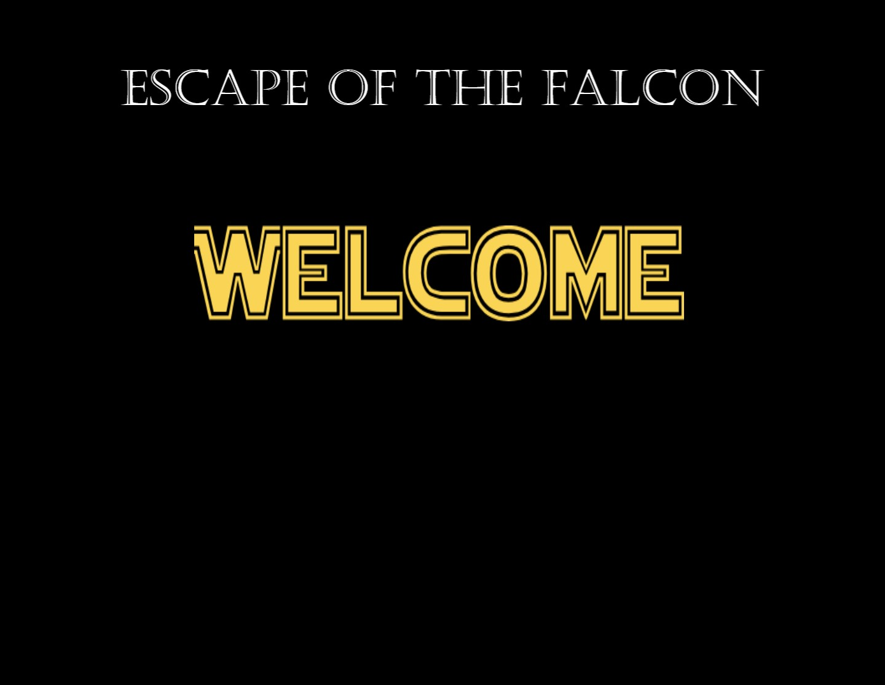

This was a pygame project completed as part of my assignments in order to practice event driven programming using Python.

To run project locally:

1. Open GitHub and find relevant [repository](https://github.com/RCass172/escape-of-the-falcon).
2. Click the 'code' dropdown.
3. Using the clone HTTPS option copy the link provided.
4. Open Git Bash and change working directory to location where you want cloned directory to go.
5. Type <b>git clone</b> command and paste the clone link you had copied.
6. Open cloned folder in your preferred IDE - I used Pycharm Community Edition.
7. Click the run button and enjoy! :) 

### &#8595; Here is a video of gameplay - Click on image below &#8595;

